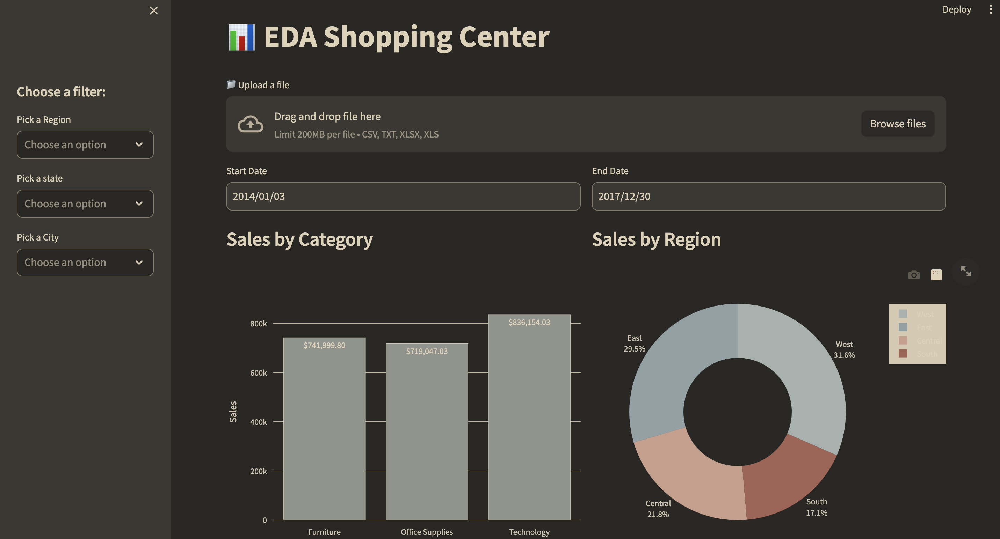

# streamlit_dashboard
#### Overview
This is an interactive dashboard project implemented with StreamLit using geographical sales data with various charts and selectors.

#### Description
This is an implementation of an interactive dashbaord of a US Supermarker with selectors which update the chart. The selectors range from Region, State, date and charts implemented include Bar chart, Pie Chart, Time Series, Tree Map and scatter plot.  
### Sneak Peak of Visualization

#### Install and run project

- git clone repo
- python3 -m venv .venv
- source .venv/bin/activate
- python3 -m pip install -r requirements.txt
- streamlit run main.py

#### View live demo on
- Download data from this repo and upload in the [Upload a file] on the link below: 
https://eda-store-us.streamlit.app/

#### Tech stack (See Requirements)

###### Data Source
Click Sample - Superstore xls file from the following link: https://community.tableau.com/s/question/0D54T00000CWeX8SAL/sample-superstore-sales-excelxls

